# Semtech SX1280 2.4ghz LoRa Ranging Tranceivers

Available since 2017 the SX1280 LoRa devices are similar to the SX1272 and SX1276/8 LoRa devices that operate in the 434Mhz, 868Mhz and 915Mhz ISM bands.

These 2.4Ghz devices do not have the very long range capability of the lower frequency LoRa devices due to the much higher attenuation of free space at the higher frequency. The devices do however allow for much higher data throughput with data transfer speeds of up to 203kbps with few duty cycle restrictions. 

The SX1280 supports LoRa bandwidths of 203khz, 406khz, 812khz and 1625khz. Available spreading factors are SF5 to SF12. Possible coding rates are 4:5 to 4:8. The effective data rates are 297bps to 203kbps. 

The SX1280 supports both a serial UART based interface and an SPI one. I have only tested and used the SPI option. 

The SX1280 has a ranging mode that can measure distance by recording the time of flight of a special packet exchange between two SX1280s. The longest range LoRa settings you can use for ranging are bandwidth 406Khz and spreading factor 10. 

I concentrated my testing on the G-NiceRF LoRa1280 devices. These are similar in size and layout to the RFM98 and DRF127x modueles I have used in the past and like those modules you have access to the antenna pin so can fit an antenna connection of choice, SMA, U.FL or a simple wire. The G-NiceRF is 12dBm output.

Semtech produce a development kit with sample code but it was not in a format that allowed for its use in the Arduino environment. The class based structure of the original bits of code was removed and reduced to just two code files, SX1280Library.h and SX1280Includes.h for Arduino. These bits of code currently just need to be included in the same folder\directory as the Arduino .ino file. When I am fully happy with the code it will be published.

The SX1280 is programmed with a series of commands followed by one or more bytes of data which is quite different to the register centric approach of the SX127x. 

  
### First Ranging tests

The first ranging tests were done on breadboards. I did not initially have a way of plugging them into a breadboard so I made my own adapters, see picture;

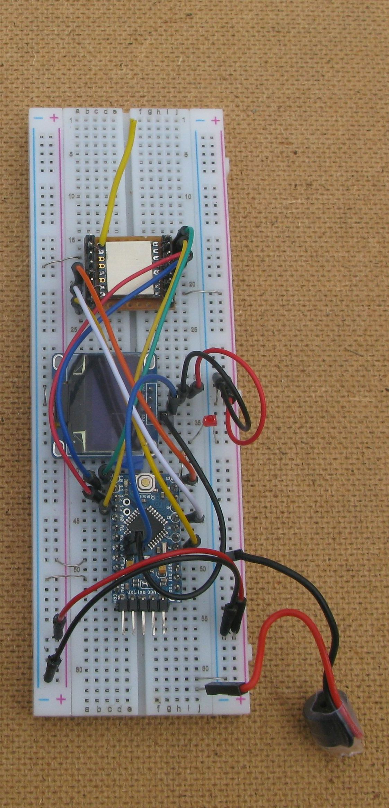
  
Whilst on a break I was staying at Walcot hall in Shropshire, it has a large open field in front of the house. 
  

  
So using the SX1280 devices on a breadboard and some preliminary ranging code, I carried out my first ranging tests. 

    Actual Distance   Indicated Distance. 
    0                 4.4M
    50M               57.6M
    100M              103M
    150M              148M
    200M              201M
    250M              253M

So not too bad, the results did seem to be consistent for large open areas. 
  
## Long Range tests

So short distance ranging seems OK, what about longer distances ?

First I needed a way of connecting 2.4Ghz antennas which normally have SMA type connectors. I designed and had made some Mikrobus and breadboard friendly boards for the G-NiceRF SX1280 LoRa devices, see pictures below;
  
 
  

The larger green PCBs are an ATMega328P based Mini Logger I designed. It can be fitted with a plug in Mikrobus compatible board. Mikroelectronica sell a range of compatible 'Click' boards, see here;

[https://www.mikroe.com/click](https://www.mikroe.com/click)

The SX1280 requires a few more pins than a standard Mikrobus module provides, so I added two pins to the normal 8 on either side for the Busy and DI03 pins. The design of these SX1280 Mikrobus boards does allow them to be used in a standard 2 x 8way Mikrobus socket. This requires that the pin connected to the Mikrobus AN pin is a dual analogue\digital pin which is often the case. 

The Mikrobus PCBs shown, the yellow ones, are breadboard friendly so will plug into a standard 0.1" breadboard, very useful for prototyping. 

A complete Arduino based transceiver fitted with an G-NiceRF SX1280 device is shown on the left of the picture above, complete with 2dBi WiFi antenna. The board was programmed in the Arduino IDE. 

### 4.4km Ranging test

North of the Cardiff where I live there is a ridge and the location is around 150M higher than where my shed is located in the city. From the ridge there is an excellent view of the city. With a SX1280 transceiver on top of the 6M mast attached to my shed there is a relatively clear line of sight from the ridge to the device on the mast, the distance is 4.4km. I use this link quite often for testing stuff.

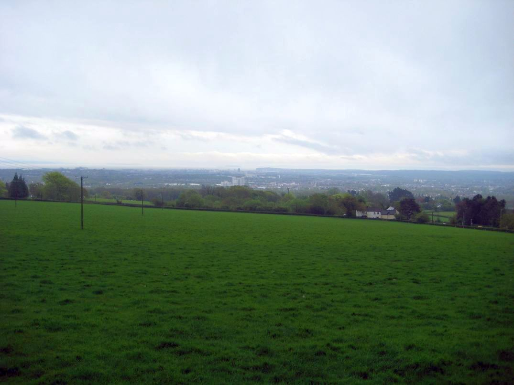 
  

I wrote ranging software that would first transmit a ranging request at high power (10dBm!) and report whether the ranging request completed. The transmit power was then reduced and another ranging request made. In this way it was possible to work out the minimum power required for the ranging to work. 

Over the 4.4km link the ranging worked down to -14dBm. Thus if the full power was used, 10dBm, this test indicates the ranging may have potential to work at over 69km.

  
### Further than 4.4km ?

From the results of the 4.4km test it's possible I could measure the 40km hilltop to hilltop line of sight I have from North of Cardiff across the Bristol channel to the Mendip hills. 

  
### 40km Ranging Test

The Cardiff location for the 40km link test is just North of city (altitude 264m) and the other end of the 40km line of sight is Black Down (altitude 325m) in the Mendips, the other side of the Bristol channel.  
  

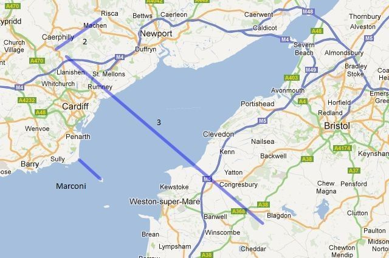

  
Route 'Marconi' on the map is the where the first radio transmission across water took place in 1897, by Mr Marconi.

The route has good line of sight and plenty of altitude in the middle of the route to reduce Fresnel zone effects, see the profile below.

  

  
At the Cardiff end there was a SX1280 ranging receiver fixed to a pole and another for a basic link test. Ehe view towards the Mendips is below;

    
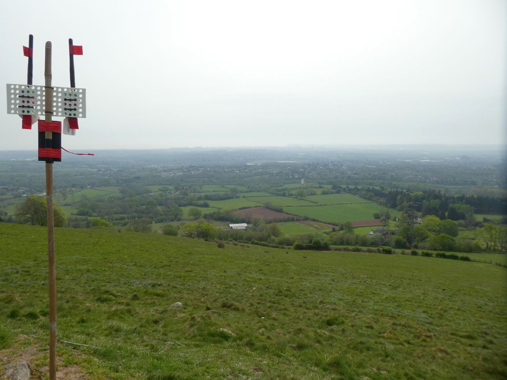

  
The view from the Mendips end towards Cardiff was similarly murky;

  
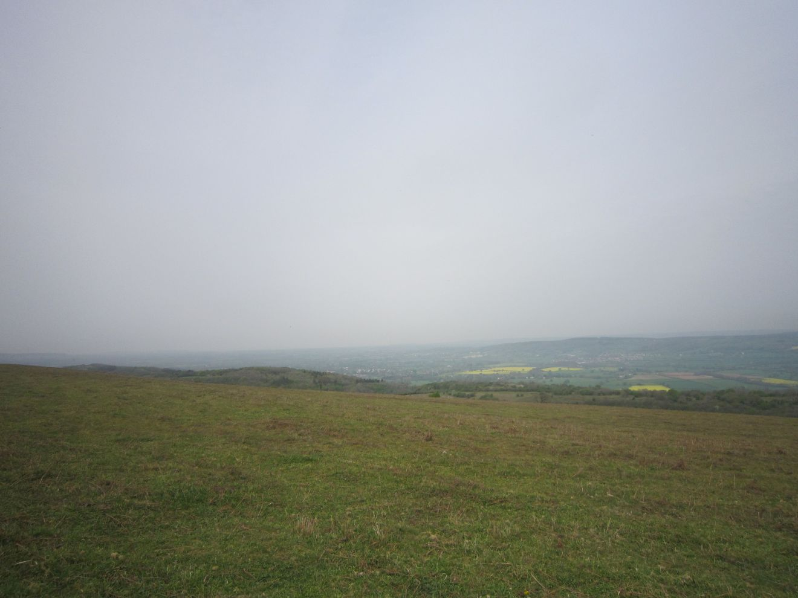
  

At the Mendips end I had a matching set of devices, one as the ranging test instigator/transmitter and another for receiving  basic link test packets. The results were logged to a micro SD card for later analysis. 

At the Cardiff end the SX1280 ranging receiver would listen for the ranging requests from the transmitter at the Mendips end and send the response. Basic 2dBi antennas were used at both ends. 

At the Mendips end the ranging request transmitter would emit a long beep at the start of the test sequence, send a ranging request at 10dBm, then 9dBm, 8dBm etc. If the ranging request was successful then the would be a short beep. Thus to work out the power level when the ranging stopped working you only had to listen for the long beep and then count the short beeps. 

The LoRa settings for the ranging were SF10 and bandwidth 406khz, the longest range settings that the SX1280 allows for ranging mode. There should have been a link disadvantage of 8dBm over the longest range mode the SX1280 can be set to for point to point LoRa. 
  
### Ranging calculations

I have yet to fully implement in full the ranging result calculation in my ranging test code, so my program would read the results from the ranging result registers (3 bytes) and log the result to the SD card on the logger. 
The path used for the '4.4km Ranging test' mentioned above was used to test and calibrate the ranging function. The ground distance was 4.42km as measured on Google maps. The average ranging result from the SX1280 was 24515. This gave a conversion factor to metres of 0.1803.

The average ranging result for the Cardiff to Mendips link was 225982. Applying the 0.1803 conversion factor gives a distance of 40.745km. The distance taken from Google Maps was 40.65km. So the SX1280 ranging produced a measurement of +0.2% over actual. Not bad.  
  

## Summary - Distance Potential of the SX1280 ranging and point to point.

The ranging requests were received down to 4dBm over the 40km link. This would imply a potential range of 80km LOS at 10dBm. Even modestly improved antennas at both ends (see antenna comparisons above) could double this range.

The longest range settings for point to point mode, SF12 and bandwidth 203khz should have a link advantage of 8dBm over the ranging settings described above, SF10 and bandwidth 406khz.  Converting this 8dBm link advantage over the ranging settings, suggests a potential range for point to point LoRa in the 200km region.     
     
  

### Stuart Robinson
### GW7HPW
### April 2019

   
   

##2.4Ghz NiceRF SX1280 LoRa Balloon Tracker - 85km Achieved

I have had the basic send and transmit function of my Arduino Library for the SX1280 working for a couple of months, but I was keen to subject the code to a real World test before publishing it. So I built a small GPS tracker (25g) to use on a high altitude balloon.

    
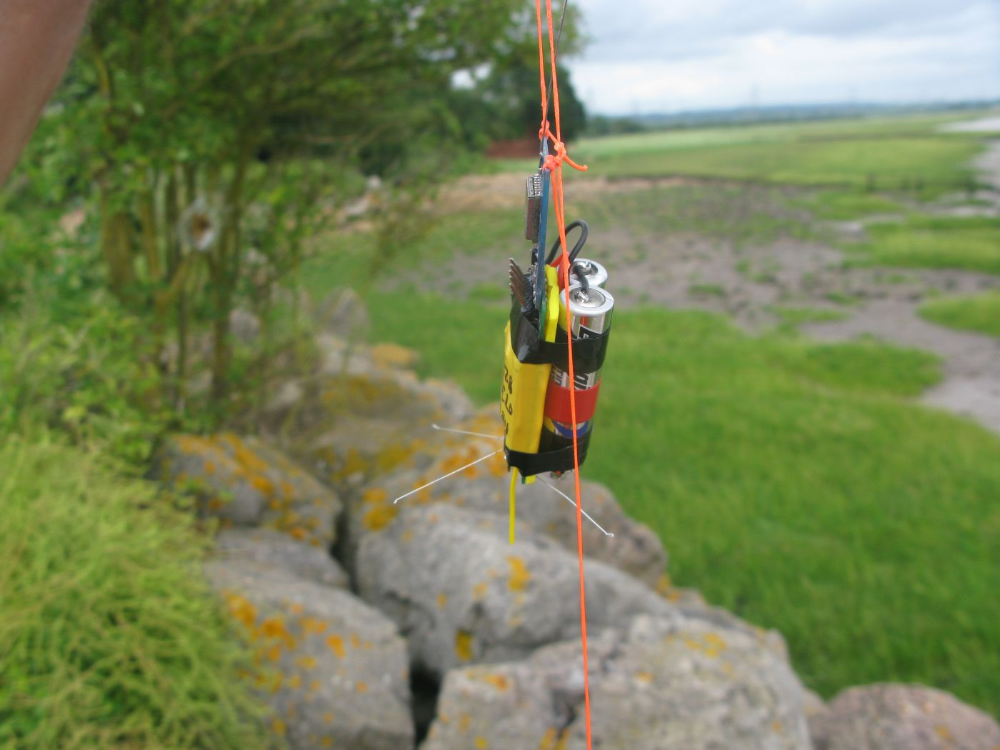
    

The SX1280 LoRa devices can calculate distance by measuring the time of flight of a special packet exchange, I wanted to see how far this ranging feature would work, I had previously tested it to 40km in a hilltop to hilltop test.

So I set about converting some balloon tracking code I had originally written for the SX127X LoRa device to use my SX1280 library. This software runs as a GPS tracker typically using an ATMega328P as on an Arduino Pro Mini. The receiver can also be powered by a Pro Mini, but to run the Micro SD data logging, display and receiver’s GPS requires a processor with more memory so I normally use a version of my LCD receiver that has an ATMega1284P processor.

Changing the code to run on the SX1280, including the remote control functions took a month or more and with it eventually working I added the SX1280 Ranging capability. For this function the remote balloon tracker would transmit a short command that the receiver identifies as a ranging request. The receiver then initiates the ranging packet exchange process and displays the results as a distance.

I eventually had a chance to test the tracker on the 22nd July, weather conditions looked suitable and the small tracker was fitted to a Qualatex 36” foil balloon and launched from the Black Rock picnic site between the two Severn bridges on the West side of the Severn.

I was not using the longest range mode of the SX1280, I chose a LoRa bandwidth of 406khz as I wanted to avoid potential issues if the tracker got very cold and the TX and RX became more than 25% of the bandwidth apart in frequency. Its possible that further work will show that the lower bandwidth of 203khz, which would give more distance capability, can be used. I am also looking at implementing an AFC capability in the software.

The balloon rose slower than expected and was moving horizontally quite quickly. A 2.4Ghz magnetic mounted antenna on my car’s roof was not receiving strong enough signals to be able to follow the pico in the car, so I stuck to tracking it from a playing field with a cheap Wi-Fi yagi.

    
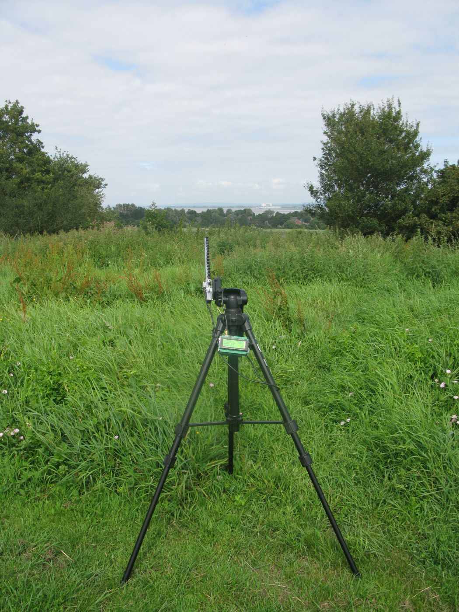
    

The balloon rose to 7903m where it apparently burst and descended. I lost contact with it when it was at 3259m altitude and the GPS calculated distance was 85.325km, direction 57degrees. The ranging function measured the distance as 85.133km, so with ranging now known to work at that distance, the flight was a success.

   
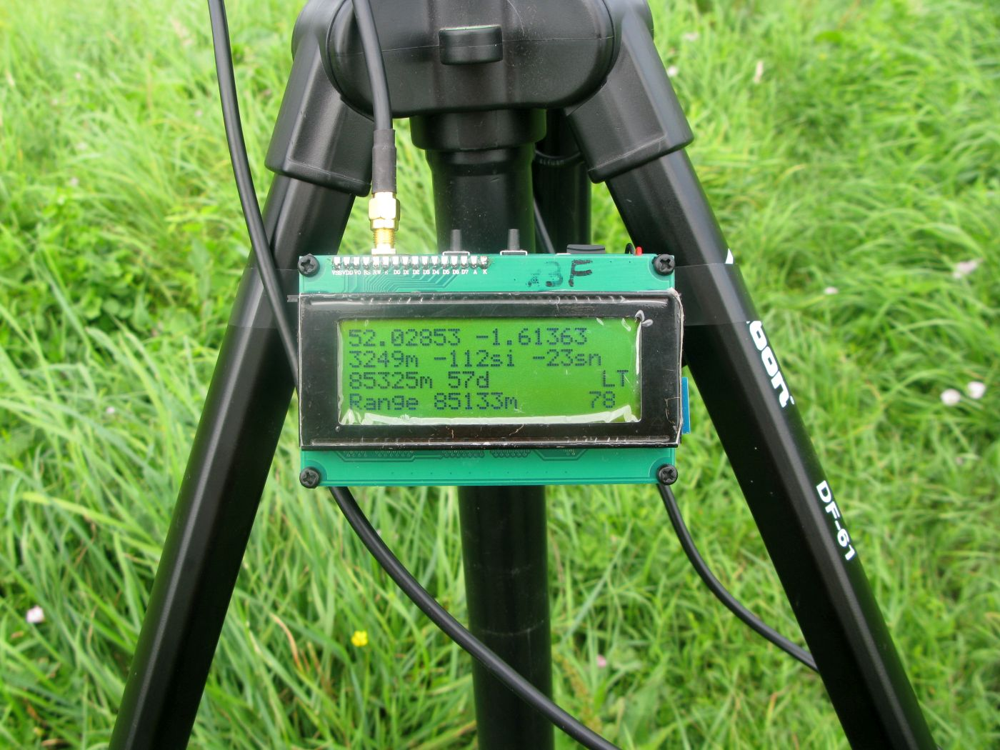
   

The Arduino library seems to work well, with perhaps some improvements required in the ranging code and an AFC capability. I particular I need to write a note on how I carried out the necessary ranging calibration.

### 2.4Ghz NiceRF SX1280 LoRa Balloon Tracker – 89km Achieved

Although I have launched a few pico, foil party type balloons, I had not participated in the launch of a ‘real’ high altitude balloon (HAB) the latex type that rises to 30km or so then bursts and comes back to ground. 

There was a HAB workshop planned for 25th/26th July in Braunton Devon so I signed up. 

Bill, who was running the workshop agreed to give one of my new 2.4Ghz LoRa trackers a ride up to altitude. The tracker was a simple design called the 'Easy Mikrobus' and is very easy to build using an ATmega328P processor used with my own Arduino library for the Semtech SX1280 LoRa device.

The assembled tracker is fairly small and there are pin headers for connection of a GPS of choice and\or sensors such as BME280 I2C types.

   
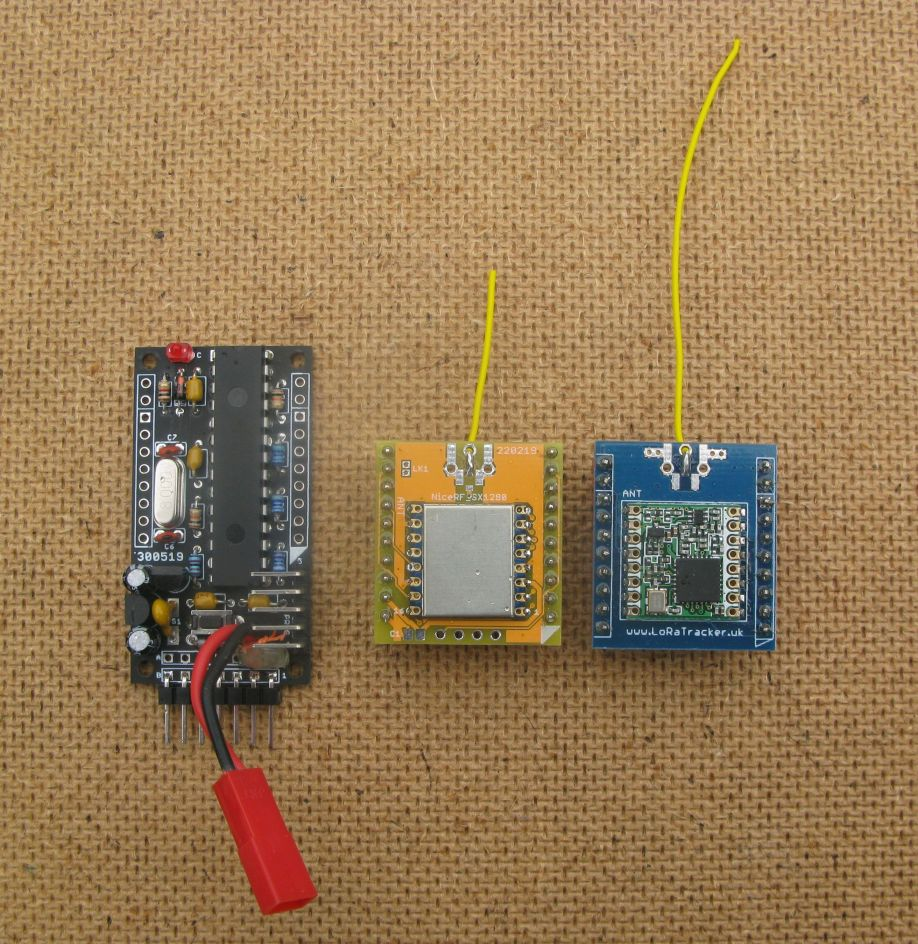
   

The board can be used with just two AAA Lithium energisers which will supply around 2.9V for most of the batteries life. The tracker board has a very low quiescent current regulator so can be used with 3 x AA batteries and still keep the sleep current of the board below 2uA.  

Although on this flight the tracker was used with a SX1280 module tracker can also be fitted with UHF 434Mhz or 868Mhz LoRa modules, sending LoRa or FSK RTTY tracking data. The board can be used as a standalone tracker for a Pico balloon or as a completely independent backup tracker for a larger balloon flight.  

The tracker board itself (left in picture above) is not specifically designed as a radio frequency (RF) tracker and does not have connections for directly mounting an RF device. Instead it has the pins to allow a Mikrobus compatible module to be fitted. Mikcroelectronica produce a range of Mikrobus boards under the ‘Click’ brand;

https://www.mikroe.com/click

I make my own Mikrobus compatible boards for the Hope RFM9x, DRF127x, RN2483 LoRa devices and most recently one for the NiceRF SX1280 and SX1261/2 LoRa devices. The simple Arduino board can then be used for 434Mhz, 868Mhz or 2.4Ghz LoRa devices just by using the appropriate Mikrobus board. The boards can either plug in on sockets, good for testing or last minute changes, or be soldered permanently in place for a more compact tracker. The components needed are all wired through hole types, so the board is very quick and easy to assemble.

The assembled 2.4Ghz tracker is fairly compact and I choose to use a standard small Wi-Fi antenna connected to the RP SMA socket.

   
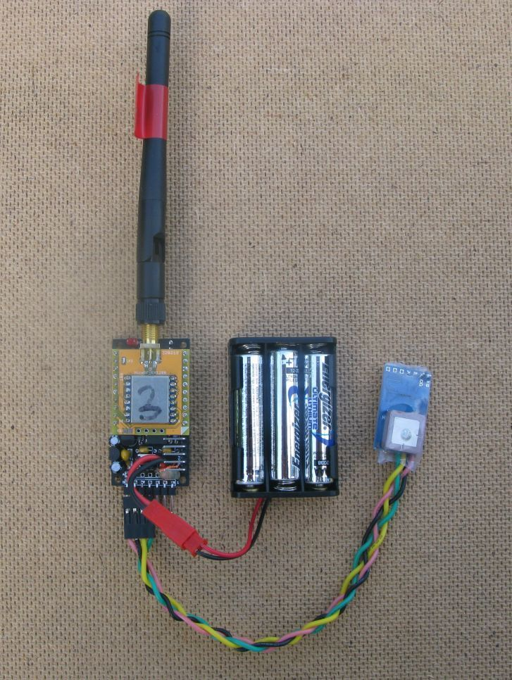
  
 

The tracker was fitted into the HAB payload box, shown below at top left with the small L70 GPS at top right. The antenna poked out of the top of the box which was not ideal but 
the Raspberry Pi in the Sky (PITS) tracker had two antennas on the bottom, one for FSK RTTY and another for LoRa. 

   

  

This is the balloon being filled with helium at the launch site. 
 
   

  

And the balloon shortly after launch with the payload bellow. 

   
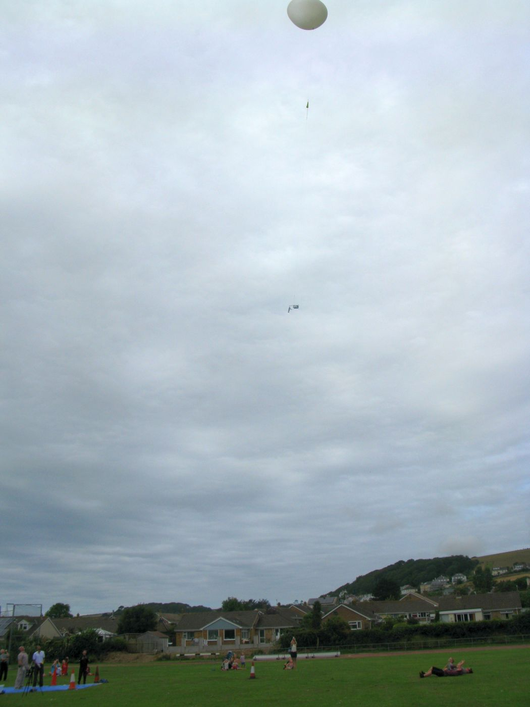
  

My ground station tracker setup was fairly simple, a low cost Wi-Fi yagi on a tripod and one of my LCD receivers with a SX1280 Mikrobus module in place. The receiver has its own GPS so when it receives the location data from the tracker can calculate the distance and direction to the tracker.  
   
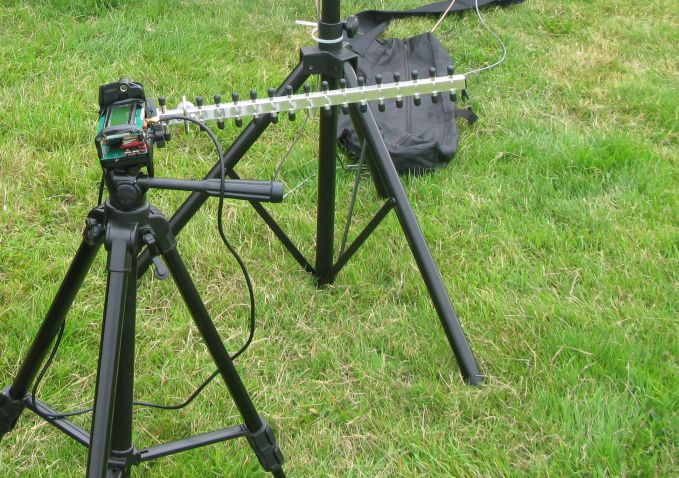
   

When the tracker was last received on 2.4Ghz LoRa it was one its way down at a distance of 89.237km and an altitude of 6895km. From the field tracking location on the North Devon coast the balloon was tracked till just short of landing with its other trackers using 434Mhz LoRa and FSK RTTY.

The balloon, call sign Vincent, landed after crossing the Bristol Channel from North Devon to land near Newcastle Emlyn, a distance of around 108km. 

The 2.4Ghz LoRa settings used were bandwidth 406khz and spreading factor 12. The lower bandwidth of 203khz should provide a bit more range with a bit of fine tuning. 

One point to note is that the L70 GPS used, bought at very low cost from China, stopped working and lost lock when the balloon went above 10km. It was seen to recover when the balloon was on the way down at 6895m. The GPS was put into balloon mode so further tests are required to identify the cause of the problem.   

The flight was an interesting test of the limits of 2.4Ghz LoRa and whilst its not going to replace the standard UHF LoRa devices for HAB tracking, as the in air range is only just adequate, reception distance at ground level especially with trees around is limited to a couple of hundred metres or so.  

The ranging or distance measuring is an interesting feature and the device is capable of some fairly high data rates, 203kbps for LoRa and the FLRC mode should cover the same distance but at a data rate of 975kbs. 
It was fun to experiment, thanks to all those involved for the workshop with a special thanks to Bill Harvey who organised it.  

The workshop was a real success despite the unfavourable Northly winds, so the balloon would have to cross a wide expanse of the Bristol channel before hopefully landing somewhere in Pembrokeshire or Camarthanshire.

###Stuart Robinson

###July 2019 